# Objective: 
Classify images of **DOGs** or **CATs** into their respective categories and check the localization capability of the **Global Max-Pooling** layer.

This project is to get a good hands on with the tensorflow and getting used to the deep learning concepts.
Classification is the most basic task that deep learning models or deep neural networks can do. 
This is a type of supervised learning where the input images of dogs or cats are given to a neural network along with their respective labels (which signifies whether the image is of a dog or a cat).
The network initially misclassifies the images, but this error in classification is back propagated through the network to make changes to its internal weights and biases of the hidden layers.
This way the network gradually identifies different features of the objects and starts to make correct classifications.
The features that the network looks at are however markedly different from what humans use to classify objects. 
The hidden layers of the network filters out different features from the images. Some of the initial hidden layers identify edges, some middle layers identify the shapes and the final layers identifies 
other high level features (like complete parts of objects). But many of these features are so abstact that by looking at the hidden layer weights, it is not always possible to say what kind of features 
they have got trained to identify.

The network is trained with large number of images and then it is tested on a set of unseen images to check the performance.

# Requirements: 
* The [training set](https://www.kaggle.com/c/dogs-vs-cats/download/train.zip) and [testing set](https://www.kaggle.com/c/dogs-vs-cats/download/test1.zip) of images can be downloaded from the [kaggle website](https://www.kaggle.com/c/dogs-vs-cats).
* The training and testing sets have to be de-compressed into two separate folders called **train** and **test** respectively.
* The training set has **25000** images out of which **5000** will be used to create a validation set and rest will be used for training. So, after de-compressing the training and testing sets, running the [utils.py](codes/utils.py) once, can create the validation set.
* Testing set has **12500** images.
* Training, validation and testing images are to be placed in folders named **train**, **valid** and **test** in the same directory that has the codes [train_classifier.py](codes/train_classifier.py).
* This training does not necessarily needs GPUs, but they will make it much faster. This model is trained on one **NVIDIA P6000 Quadro GPU** in the [**Paperspace**](https://www.paperspace.com/) cloud platform.

# Current Framework: 
* Tensorflow 1.7.0 (with GPU preferred). 
* Opencv libraries, Ubuntu 16.04, Python 3.6.3 (Anaconda).

# Data Preprocessing, Hyperarameter and Code Settings:
**[NOTE] All these settings are specified in the [config.py](codes/config.py) file.**
* The mean and standard deviation of the training set is used to normalize the images during training. And the same is used to normalize during validation and testing.
* Images are all resized into **224 x 224 x 3** size before feeding into the network.
* **Batch size: 100**
* **Epochs: 38**
* **Learning rate: 0.001 (upto epoch 1 - 24), 0.0003 (epoch 25 - 34), 0.0001 (epoch 35 - 38)**
* **Number of Classes ( nClasses ): 2 ('dog', 'cat')**
* The trained neural network model is saved at every epoch. And only the 5 latest such saved models or checkpoints are retained inside the [temp](codes/temp) directory.
* The training logs are saved in the [logs](codes/logs) directory.

# Scripts and their Functions:
* [**config.py**](codes/config.py): All important parameters are defined here.
* [**utils.py**](codes/utils.py): All important functions used for the training or testing process are defined here. There are also some extra functions as well.
* [**train_classifier.py**](codes/train_classifier.py): The network model and training process are defined in this script.
* [**application.py**](codes/application.py): Evaluates the output on fresh images and also shows the localization ability of the Global Max-Pooling (GMP) layer of the network.

# Network Architecture:

### Layer 1:
**Conv --> Relu --> Batch-Norm --> Max-pool**

| Input | Conv Kernel | Filters | Output | Activation | Max-pool Kernel | Max-pool Stride | Max-pool Output |
|:-----:|:-----------:|:-------:|:------:|:----------:|:---------------:|:---------------:|:---------------:|
| 224 x 224 x 3 | 3 x 3 | 32 | 224 x 224 x 32 | Relu | 2 x 2 | 2 | 112 x 112 x 32 |

### Layer 2:
**Conv --> Relu --> Batch-Norm --> Max-pool**

| Input | Conv Kernel | Filters | Output | Activation | Max-pool Kernel | Max-pool Stride | Max-pool Output |
|:-----:|:-----------:|:-------:|:------:|:----------:|:---------------:|:---------------:|:---------------:|
| 112 x 112 x 32 | 3 x 3 | 64 | 112 x 112 x 64 | Relu | 2 x 2 | 2 | 56 x 56 x 64 |

### Layer 3:
**Conv --> Relu --> Batch-Norm --> Max-pool**

| Input | Conv Kernel | Filters | Output | Activation | Max-pool Kernel | Max-pool Stride | Max-pool Output |
|:-----:|:-----------:|:-------:|:------:|:----------:|:---------------:|:---------------:|:---------------:|
| 56 x 56 x 64 | 3 x 3 | 128 | 56 x 56 x 128 | Relu | 2 x 2 | 2 | 28 x 28 x 128 |

### Layer 4:
**Conv --> Relu --> Batch-Norm --> Max-pool**

| Input | Conv Kernel | Filters | Output | Activation | Max-pool Kernel | Max-pool Stride | Max-pool Output |
|:-----:|:-----------:|:-------:|:------:|:----------:|:---------------:|:---------------:|:---------------:|
| 28 x 28 x 128 | 3 x 3 | 256 | 28 x 28 x 256 | Relu | 2 x 2 | 2 | 14 x 14 x 256 |

### Layer 5:
**Conv --> Relu --> Batch-Norm**

| Input | Conv Kernel | Filters | Output | Activation |
|:-----:|:-----------:|:-------:|:------:|:----------:|
| 14 x 14 x 256 | 3 x 3 | 512 | 14 x 14 x 512 | Relu |

### Layer 6:
**Conv --> Relu --> Batch-Norm**

**[NOTE] This is a Bottle-neck Layer**

| Input | Conv Kernel | Filters | Output | Activation |
|:-----:|:-----------:|:-------:|:------:|:----------:|
| 14 x 14 x 512 | 1 x 1 | 256 | 14 x 14 x 256 | Relu |

### Layer 7:
**Conv --> Relu --> Batch-Norm --> Global-Max-Pool (GMP)**

| Input | Conv Kernel | Filters | Output | Activation | GMP Kernel | GMP Stride | GMP Output |
|:-----:|:-----------:|:-------:|:------:|:----------:|:----------:|:----------:|:----------:|
| 14 x 14 x 256 | 3 x 3 | 512 | 14 x 14 x 512 | Relu | 14 x 14 | 1 | 1 x 1 x 512 |

### Layer 8:
**Dense --> Dropout --> Softmax**

The output from the Layer 7 is flattened from 1 x 1 x 512 to the shape of 512 and fed into a dense layer. The dense layer has 2 output nodes, as there are only two (dog and cat) classification categories.

| Input | Output | Keep-probablity of Dropout | Activation |
|:-----:|:------:|:--------------------------:|:----------:|
| 512 | 2 (nClasses) | 0.5 | Softmax |

# Short Description of Training:
The network architecture is defined in the [train_classifier.py](codes/train_classifier.py) script.
The training process is also defined in the same script. Several functions and parameters that are used by the training process are defined in the [utils.py](codes/utils.py) and [config.py](codes/config.py) scripts.
Training happens in batches and after every epoch the model evaluated on the validation set. The training and validation accuracy are recorded in the log files (which are saved in the [logs](codes/logs) directory) and then the model is saved as a checkpoint. 
Another **json** file is also saved along with the checkpoint, which contains the details of the hyperparemeters (for the current epoch), training and validation accuracy upto the current epoch and also the training dataset mean and standard deviation.
These information from this json file are reloaded into the model to restart the training, in case the training process got stopped or interrupted because of any reason.

According to the [Learning Deep Features for Discriminative Localization paper](http://cnnlocalization.csail.mit.edu/Zhou_Learning_Deep_Features_CVPR_2016_paper.pdf), the **Global Max-Pooling (GMP)** layer is able to localize the parts of the image which the network emphasizes on to classify objects. 
In this network as well the GMP layer is used. So , after classification the localzation ability of the GMP layers are tested and the results are shown in the result section.

# Results:
### The final accuracies of the model are as follows:

| Training Accuracy | Validation Accuracy | Testing Accuracy |
|:-----------------:|:-------------------:|:----------------:|
| 100.00 % | 94.02 % | 93.12 % |

### Prediction label superimposed on the input image fed to the network.

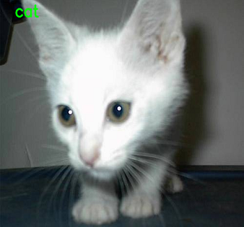
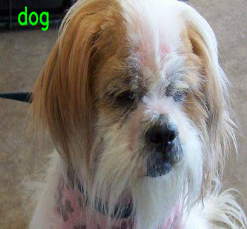

Next, the regions where the network focusses to find the most important features to classify the object is found out.
This is represented by the heat map shown below, obtained from the GMP layer.
This is found out in the same manner as explained in the [Learning Deep Features for Discriminative Localization paper](http://cnnlocalization.csail.mit.edu/Zhou_Learning_Deep_Features_CVPR_2016_paper.pdf).

### Heat map showing the regions where the network focusses to classify the objects.

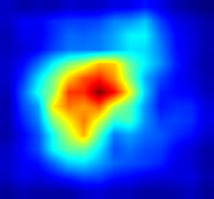
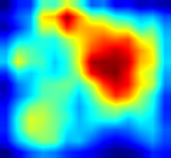

### Heat map superimposed on the actual image

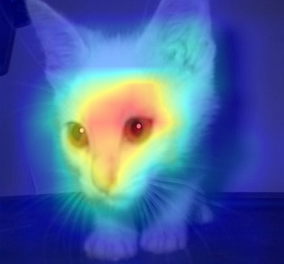
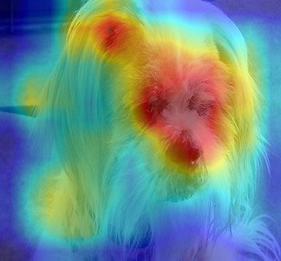

# Observations and Discussions:

The heat map does not always engulfs the complete object as is seen in the next set of figures. 

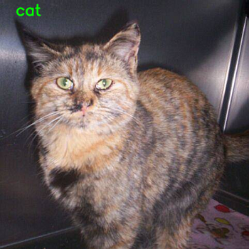
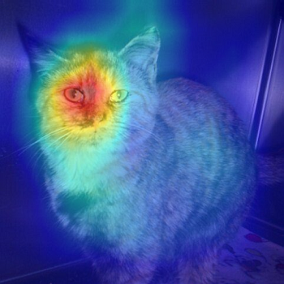

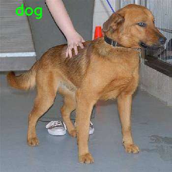
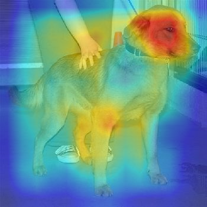

This is because the most important features required to classify the object is often only a part of the object and not its complete body.
In case of cats for most of the images, the most red part of the heat map was near the face of the cat. As that is the most significant feature to identify it (as per the networks judgement). The same is true for dogs as well.

However, in cases where the face of the cat or dog is not sufficient to identify it, the network looks for other features from other part of the object (as seen in the first set of figures).
This is also evident from the following image of the dog. In this image because the face of the dog is not highlighted properly (due to a dark environment), so the network focusses on the legs of the dog to classify it.

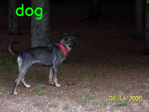
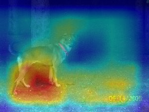

### An overall look of the images with the superimposed heat maps is shown below.

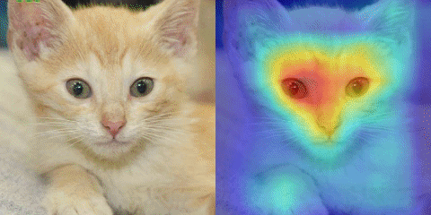
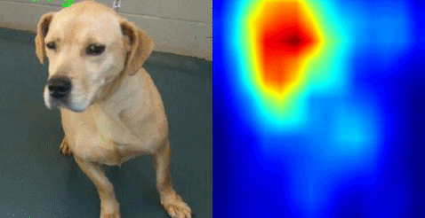

